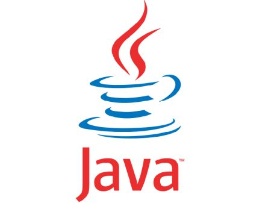

# java 

## O que é?

 Java é uma linguagem de programação orientada a objetos e foi lançado em
 1995,pela **Sun Microsystems**, futuramente adiquirida pela **Oracle**.
 Teve inicio no ano de 1991 com o Green Project, no qual os mentores foram Patrick Naughton, Mike Sheridan, e **James Gosling**
(criador conhecido como pai do java).

 Hoje e uma das principais linguagem de programção utilizadas para
desenvolvimento de apricações WEB e Mobile.

### Portabilidade
 O java possui uma serie de pacotes e um deles é a JVM(Java Virtual Machine)
que é um programa que carrega e executa os aplicativos Java, convertendo os
bytecodes em código executável de máquina. Graças a isso s programas
escritos em Java podem funcionar em qualquer plataforma de hardware e
software que possua uma versão da JVM.

### JDK e JRE
 JDK é a sigla para Java Development Kit. O kit de desenvolvimento Java é um
conjunto de utilitários que permite criar sistemas de software para a
plataforma Java.

 Já JRE é a sigla para Java Runtime Environment. O Ambiente de Execução do
Java irá te fornecer as bibliotecas padrões do Java para o JDK compilar o
código e para a JVM executar o programa.

Download do [java](https://www.oracle.com/java/technologies/downloads/)

### Referencias

* [java](https://www.java.com/pt-BR/)
* [Info Escola](https://www.infoescola.com/informatica/historia-do-java/)
* [Zup](https://www.zup.com.br/blog/java#:~:text=O%20Java%20é%20uma%20linguagem,como%20o%20pai%20do%20Java.)
